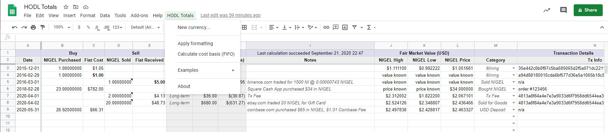

# HODL Totals

Your crypto data is yours to keep; I built this so that you could own your data and manage the data in a convienent way without a need to send your coin data to anyone else.

These Google Apps Scripts will add menu commands to Google Sheets that will help you track cost basis and long-term or short-term treatment for your cryptocurrency trades. 
It uses the first-in, first-out (FIFO) cost method, which is commonly used for tax compliance.

## Usage

Two options for getting started:

OPTION 1 - Wait until the Google Workspace Marketplace approves this as an Add-on, and then download it from within your Google Sheets

OPTION 2 - Start now by coping this google sheet into your account.  I wrote some quick instructions on the first tab and generated a few examples. 
You will need to granting the scripts permission to execute before any Formatting or Cost Basis calculations take place.

## Getting Started

COMING SOON - Free Training Videos!

## Development Environment

- Windows 10 PC with WSL2 (Ubuntu 20.04.1 LTS)
- Visual Studio Code on Windows 10, and its WSL2 integration for editing code stored in WSL
- GitHub CLI commands via the WSL2 Linux terminal
- Publish changes to your live google sheet(s) using clasp from the command line - https://developers.google.com/apps-script/guides/clasp

## Changelog
- 01-23-21 - Addressed a laundry list of cleanup issues, in preparation for inital submission to the Google Marketplace.
- 11-29-20 - Addressed Signficant performance issues for > 1000 purchase transactions (long running script may not finish executing before Google times out the job)
- 08-31-20 - Ported logic from alanhett's VBScript Macros to Google Apps Script for FIFO cost basis calc.

### Disclaimer

* This spreadsheet does not constitute legal or tax advice.  Tax laws and regulations change frequently, and their application can vary widely based on the specific facts and circumstances involved. You are responsible for consulting with your own professional tax advisors concerning specific tax circumstances for your business. I disclaim any responsibility for the accuracy or adequacy of any positions taken by you in your tax returns.*

### About

Did this save you a tax prep headache?

Support development with a BTC donation: [38Ehpz3XutgoVEUZWtrXvrWTLJetkDZF5s](https://www.blockchain.com/btc/address/38Ehpz3XutgoVEUZWtrXvrWTLJetkDZF5s)
or a VRSC donation to dogracer.vrsc@
